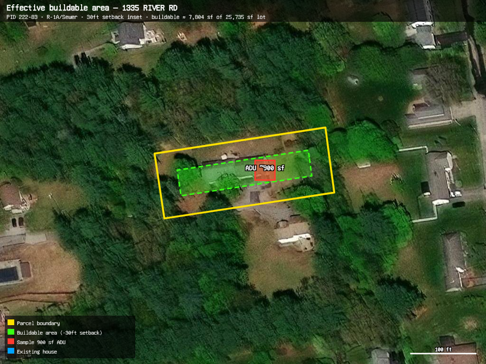

# ADU Feasibility Report — 1335 River Road, Manchester, NH 03104

**Parcel PID:** 222-83 (NH_GIS_ID 064134-222-83; VGSI pid 6246) &nbsp;|&nbsp; **Date:** 2026-07-13

## Verdict: ✅ Feasible by-right
A **detached (or attached) ADU up to 900 sq ft, ≤2 bedrooms** is allowed on this lot with only
a building permit — no variance or special exception — under **RSA 674:71–73 (HB 577, eff.
7/1/2025)**, which makes one ADU by-right wherever single-family dwellings are permitted. The
lot clears all 7 feasibility gates; the only material open item is confirming public
sewer/water at the tap (§7).

## Effective buildable area

*Yellow = parcel boundary · green = effective buildable area after a conservative 30 ft setback
inset · red = a sample 900 sq ft ADU footprint (illustrative placement) · blue dot = existing
house. Buildable area ≈ **7,804 sq ft** of the 25,735 sq ft lot. The green envelope uses a
uniform 30 ft inset (the largest of the front/side/rear setbacks) so it is conservative; the
actual side-yard buildable strip is a bit wider (side setback is 20 ft). Final ADU placement
must also sit ≥5 ft from the primary structure, out of the front yard, and clear the existing
driveway — confirm with a site plan.*

---

## 1. Property snapshot
| Field | Value | Source |
|---|---|---|
| Owner | JENNISON, JESSICA L | VGSI assessor card |
| Assessed value (2025) | $397,400 | VGSI |
| Last sale | $605,000, 05/16/2024, Bk/Pg 9775/1322 | VGSI |
| Use code | 1010 — SINGLE FAM | VGSI |
| Lot size | 25,740 sq ft (0.59 ac) VGSI / 25,778 sq ft GRANIT | VGSI + NH GRANIT |
| Parcel dims | ≈ 272 ft × 137 ft (7-sided, 719 ft perimeter) | NH GRANIT geometry |
| Zoning district | **R-1A/Sewer** — Residential One-Family, Medium Density | NH Zoning Atlas |
| Building | Ranch, 1 story, built 1979, 1,416 sq ft 1st-floor living area, 3 bed / 2.5 bath | VGSI |
| Building footprint | 1st floor 1,416 + garage 780 + enclosed porch 332 + open porch 110 = **2,638 sq ft (~10%)** | VGSI sub-areas |

---

## 2. The 7 feasibility gates
| # | Gate | Status | Evidence / Source |
|---|---|---|---|
| 1 | **Legal / Zoning** | ✅ | R-1A/Sewer; single-family allowed → one ADU **by-right** under RSA 674:72. NH Zoning Atlas lists ADU treatment "Public Hearing," but that is a **pre-HB 577 snapshot** and is overridden by current state law. |
| 2 | **Dimensional fit** | ✅ | Lot 0.59 ac ≫ 0.27 ac min; frontage well over 100 ft min. See §3. |
| 3 | **Flood** | ✅ Cleared | FEMA NFHL: **Zone X, SFHA=F** (not a Special Flood Hazard Area). |
| 3b | **Shoreland** | ✅ Cleared | NH GRANIT + official NHDES Shoreland Protection Act layer: **not in jurisdiction**; nearest 4th-order+ water (Merrimack River) ≈ 2,600–3,000 ft away. RSA 483-B does not apply despite the "River Rd" name. |
| 3c | **Wetlands** | ✅ Cleared | 0 wetland features within 100 ft (NH GRANIT / NHDES). |
| 3d | **Environmental due-diligence** | ✅ Cleared | 0 hazard sites (USTs, remediation, salvage, hazwaste, asbestos, solid waste) within 1,000 ft (NHDES). Groundwater class **GA2** (standard). |
| 4 | **Wastewater** | ⚠️ Confirm | District variant "**R-1A/Sewer**" and the 2024 listing both indicate **public sewer**. Not independently re-confirmed — NHDES OneStop (septic records) is Akamai bot-protected. |
| 5 | **Water** | ⚠️ Confirm | Public water likely (urban North End) but unconfirmed. |
| 6 | **Utilities & site** | 🤖 Routine | Urban developed street. **NH811 locate required** before excavation. |
| 7 | **Process / cost** | 🤖 Routine | NH State Building Code = 2021 IRC/IBC. Impact fees: building permit ≈ cost × 0.006; Planning Board $250 + $100/unit; ADU subject to Article 13 impact fee (exact $ via PCD). Owner-occupancy deed restriction required. |

---

## 3. Buildable-envelope calculation
- **Lot area:** 25,740 sq ft (VGSI).
- **Max lot coverage (buildings + impervious):** 40% → **10,296 sq ft** allowed.
- **Existing building footprint:** 2,638 sq ft (~10.2%); with driveway/deck est. ~15%.
- **Adding a 900 sq ft ADU** + pad/walkway (~1,300 sq ft) → total ≈ 20% coverage — well under 40%. ✅
- **FAR:** max floor area 25,740 × 0.3 = 7,722 sq ft; existing ~2,528 sq ft finished. ✅
- **Setbacks** F25 / S20 / R30 ft on a 272 × 137 ft lot leave a large rear/side envelope
  (≈ 7,804 sq ft after a conservative uniform 30 ft inset — see map).
- **Conclusion:** a 900 sq ft / 2-bedroom ADU fits **by-right**, pending confirmed sewer/water.

---

## 4. Task matrix
| Task | Type | Notes |
|---|---|---|
| Statute/zoning + dimensional + ADU rules | 🤖 Done | RSA 674:72, NH Zoning Atlas |
| Parcel, flood, shoreland, wetlands, environmental, groundwater | 🤖 Done | NH GRANIT, FEMA NFHL, NHDES |
| Assessor card (owner, value, footprint, sales) | 🤖 Done | VGSI |
| Buildable-envelope math + site-map image | 🤖 Done | this report §3 + map |
| Confirm public sewer & water at the tap | 🧑 Human | Manchester EPD / Water Works — OneStop bot-blocked |
| Manchester ADU impact-fee exact $ | 📨 Request | Manchester PCD |
| Building permit + plans (2021 IRC/IBC) | 📨 Request | Town Building/PCD portal |
| Owner-occupancy deed restriction | 📨 Request | Hillsborough County Registry of Deeds |
| NH811 / Dig Safe locate | 📨 → 🧑 | File ≥72 hrs before excavation |
| On-site inspections | 🧑 Human | footing, framing, electrical, plumbing, insulation, final |

---

## 5. Open questions for the owner
- Attached vs. detached ADU (affects placement/setback math and the map above).
- Owner-occupancy (required by NH law) acceptable?
- Budget ceiling (finish level; tie into existing utilities vs. new service).
- ADU bedroom count (max 2 here).

## 6. Data gaps
- **Septic/well records** — NHDES OneStop is Akamai bot-protected; could not confirm sewer vs.
  septic from state records. Public sewer inferred from the R-1A/**Sewer** district variant and
  the 2024 listing — strong but not a confirmed fact.
- **Exact ADU impact-fee dollar amount** — formula known; figure needs PCD confirmation.
- **Precise building placement / site survey** — the site map uses the parcel geometry and a
  conservative uniform setback; a stamped site plan is needed before permitting to place the
  ADU exactly (≥5 ft from the house, out of the front yard, clear of the driveway).

## 7. Notes
Owner of record is **JENNISON, JESSICA L** — this appears to be the requester's own/family
property, used here as the test case. Figures are from public records and should be re-verified
against official town/state sources before design.
